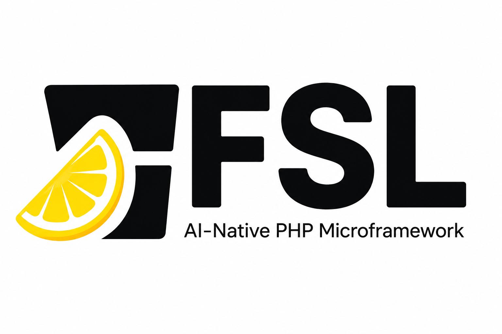

<p align="center"></p>

# FSL (Fresh Squeezed Limonade) - AI Native PHP Micro-Framework

Build AI-powered APIs, LLM services, and MCP servers in PHP - no Composer required. FSL is for PHP developers who want to expose existing PHP code as AI-callable APIs and MCP tools without adopting Laravel, Symfony, Node, or Composer.

You can use the same stack for **rapid web application development** (routing, templates, layouts, sessions, forms) and for **mobile app backends**—JSON APIs, auth, and HTTP primitives your native or hybrid clients call over HTTPS.

**Requirements:** PHP 8.0+

---

## Quick Start

```php
<?php
require 'lib/fsl.php';

function configure() {
    option('anthropic_api_key', getenv('ANTHROPIC_API_KEY'));
}

dispatch_post('/chat', function() {
    $message = env()['POST']['message'] ?? '';
    $response = fsl_anthropic_chat([
        ['role' => 'user', 'content' => $message],
    ]);
    return json(['reply' => $response['content'][0]['text']]);
});

run();
```

Point your web server at the project root, or run `php -S localhost:8080` for local development.

---

## Why FSL?

- **AI-native** - built-in Anthropic and OpenAI helpers; LLM calls in one line
- **MCP-ready** - expose any function as an MCP tool in ~10 lines; spec-compliant JSON-RPC 2.0
- **API-first** - native JSON responses, HTTP method routing, status code helpers
- **Rapid web and mobile backends** - ship browser apps or JSON APIs for iOS, Android, and hybrid clients with the same routing, responses, and template helpers
- **Minimal footprint** - one `require`, no Composer, no build step
- **Built-in security** - AES-256-CBC encryption, encrypted sessions, CSRF, JWT
- **HTTP client included** - `fsl_curl()` covers all auth patterns for calling external APIs and agent tool backends

---

## Documentation

| Topic | Link |
|-------|------|
| Helper functions (encryption, sessions, curl, CSRF, JWT, …) | [docs/helpers-fsl_functions.md](docs/helpers-fsl_functions.md) |
| AI / LLM (Anthropic, OpenAI) | [docs/helpers-ai.md](docs/helpers-ai.md) |
| MCP server (tools, JSON-RPC) | [docs/helpers-mcp.md](docs/helpers-mcp.md) |
| Index | [docs/README.md](docs/README.md) |

---

## Installation

Clone or download the repository:

```bash
git clone https://github.com/yesinteractive/fsl.git
cd fsl
```

No Composer, no dependencies. Drop the files into your project and `require 'lib/fsl.php'`.

---

## Directory Structure

```
fsl/
+-- docs/
|   +-- README.md                 # Doc index
|   +-- helpers-fsl_functions.md
|   +-- helpers-ai.md
|   +-- helpers-mcp.md
+-- lib/
|   +-- fsl.php               # Core framework - require this
|   +-- fsl_functions.php     # Helper functions (encryption, sessions, curl, etc.)
|   +-- fsl_ai_functions.php  # AI/LLM helpers (Anthropic, OpenAI)
|   +-- fsl_mcp_functions.php # MCP server support
|   +-- jwt_helper.php        # JWT encode/decode
+-- config/
|   +-- fsl_config.php        # App configuration (configure() function)
+-- controllers/
|   +-- fsl_controllers.php   # Route handlers
+-- views/
|   +-- *.php                 # HTML templates for web UIs
+-- index.php                 # Entry point
```

All files in `lib/` are auto-loaded - drop a new `.php` file there and its functions are immediately available.

---

## Configuration

Configuration lives in `configure()` inside `config/fsl_config.php`. FSL calls this automatically on startup.

```php
function configure() {
    option('env', ENV_DEVELOPMENT);     // ENV_DEVELOPMENT or ENV_PRODUCTION
    option('base_uri', '/');            // Set to subdirectory if not in web root
    option('session', 'myapp');         // Session name; omit to disable sessions
    option('fsl_session_length', 300);  // Session timeout in seconds
    option('global_encryption_key', 'your-base64-key-here');
}
```

Generate an encryption key:

```bash
php -r "echo base64_encode(random_bytes(32));"
```

### Options Reference

| Option | Default | Description |
|--------|---------|-------------|
| `env` | `ENV_PRODUCTION` | `ENV_DEVELOPMENT` enables error display |
| `base_uri` | `/` | URL prefix when app is in a subdirectory |
| `session` | `null` | Session name; `null` disables sessions |
| `fsl_session_length` | `300` | Session lifetime in seconds |
| `global_encryption_key` | - | Base64 AES-256 key for `fsl_encrypt`/`fsl_session_set` |
| `gzip` | `false` | Enable gzip output compression |
| `views_dir` | `views/` | Directory for HTML templates |
| `controllers_dir` | `controllers/` | Directory for controller files |
| `lib_dir` | `lib/` | Directory for auto-loaded libraries |
| `anthropic_api_key` | - | Anthropic API key (see [docs/helpers-ai.md](docs/helpers-ai.md)) |
| `anthropic_model` | (library default) | Model id for `fsl_anthropic_chat` |
| `openai_api_key` | - | OpenAI API key |
| `openai_model` | (library default) | Model id for `fsl_openai_chat` |
| `mcp_server_name` | `FSL MCP Server` | Name in MCP `initialize` (see [docs/helpers-mcp.md](docs/helpers-mcp.md)) |
| `fsl_version` | - | Shown in MCP `serverInfo.version` when set |

---

## Routing

### Basic Routing

```php
dispatch('/', 'home');              // any method
dispatch_get('/users', 'list_users');
dispatch_post('/users', 'create_user');
dispatch_put('/users/:id', 'update_user');
dispatch_patch('/users/:id', 'patch_user');
dispatch_delete('/users/:id', 'delete_user');
```

The second argument is a controller function name or an anonymous function:

```php
dispatch_get('/ping', function() {
    return json(['status' => 'ok']);
});
```

### URL Parameters

```php
dispatch_get('/users/:id', 'get_user');

function get_user() {
    $id = params('id');   // named param
    // ...
}
```

### Wildcards

```php
dispatch('/files/*', 'serve_file');       // * matches a single path segment
dispatch('/assets/**', 'serve_assets');   // ** matches multiple path segments
```

Access wildcard values with `params(0)`, `params(1)`, etc.

Named wildcards:

```php
dispatch(array('/users/:id/posts/*', 'post_slug'), 'get_post');
// params('id'), params('post_slug')
```

### Regex Routes

```php
dispatch('^/products/([0-9]+)$', 'get_product');
// params(0) = first capture group
```

### Query String & POST body

Route parameters use `params('id')` etc. For **JSON POST** bodies (`Content-Type: application/json`), use `env()['POST']` (see [docs/helpers-ai.md](docs/helpers-ai.md)).

```php
$q = $_GET['q'] ?? null; // or env()['GET']['q'] when env is populated
```

```php
$payload = env()['POST'] ?? [];
```

## Responses

### Content Types

| Function | Content-Type | Notes |
|----------|-------------|-------|
| `html($content)` | `text/html` | Wrap a string or template output |
| `json($data)` | `application/json` | Accepts array or string |
| `xml($content)` | `text/xml` | |
| `css($content)` | `text/css` | |
| `js($content)` | `text/javascript` | |
| `txt($content)` | `text/plain` | |

```php
// JSON response
function list_users() {
    return json(['users' => user_find_all()]);
}

// HTML template
function show_user() {
    $user = user_find(params('id'));
    return html(render('user_show', ['user' => $user]));
}
```

### Status Codes

```php
status(201);          // set HTTP status code
status(404);
```

### Redirects

```php
redirect_to('/login');                   // 302 redirect
redirect_to('/dashboard', array(), 301); // 301 redirect
```

### Errors

```php
halt(NOT_FOUND, 'User not found');              // 404 — short alias
halt(SERVER_ERROR, 'DB unavailable');           // 500 — short alias
halt(HTTP_FORBIDDEN, 'Not allowed');             // 403
halt(HTTP_BAD_REQUEST, 'Invalid input');        // 400
```

Most HTTP codes use the `HTTP_*` constants (for example `HTTP_BAD_REQUEST`, `HTTP_UNAUTHORIZED`, `HTTP_NOT_FOUND`). Limonade-style aliases exist for some codes, including `NOT_FOUND` and `SERVER_ERROR`.

---

## Templates

Templates are PHP files in the `views/` directory.

```php
// Controller
function show_profile() {
    return html(render('profile', ['name' => 'Alice', 'age' => 30]));
}

// views/profile.php
<h1><?php echo h($name); ?></h1>
<p>Age: <?php echo $age; ?></p>
```

### Template Helpers

| Helper | Description |
|--------|-------------|
| `h($str)` | HTML-escape a string (alias for `htmlspecialchars`) |
| `url_for($path, $params)` | Build a URL with query string (ampersands are HTML-encoded) |
| `partial($template, $vars)` | Include a sub-template |
| `flash_now($name, $msg)` | Set a flash message for the current request |
| `flash($name)` | Read and clear a flash message |

### Layouts

```php
// views/layout.php
<html><body>
  <?php echo $content; ?>
</body></html>

// In configure():
option('layout', 'layout');
```

### File Rendering

```php
return render_file('/path/to/file.html'); // send any file as HTML response
```

---

## Lifecycle Hooks

| Hook | When it runs |
|------|--------------|
| `configure()` | Once at startup - set options, open DB connections |
| `initialize()` | After configure, before routing - app-level setup |
| `before()` | Before every request - auth checks, logging |
| `after()` | After every request |
| `before_render($content)` | Before rendering output - modify content |
| `autorender($action_result)` | Custom rendering logic |
| `before_exit()` | Just before script exits |
| `before_sending_header($header)` | Intercept headers before sending |

```php
function before() {
    if (!is_logged_in() && request_uri() !== '/login') {
        redirect_to('/login');
    }
}

function after() {
    log_request(request_method(), request_uri(), status());
}
```

---

## Sessions

### Native Sessions

```php
// In configure():
option('session', 'myapp');

// Use $_SESSION directly:
$_SESSION['user_id'] = 42;
$id = $_SESSION['user_id'];
```

### Encrypted Sessions

`fsl_session_set` / `fsl_session_check` store **string** values encrypted in `$_SESSION` (use `json_encode` / `json_decode` for arrays). See [docs/helpers-fsl_functions.md](docs/helpers-fsl_functions.md).

```php
fsl_session_set('user_id', '42');
$id = fsl_session_check('user_id'); // string or false if missing/expired
```

Requires `global_encryption_key` to be set in `configure()`.
